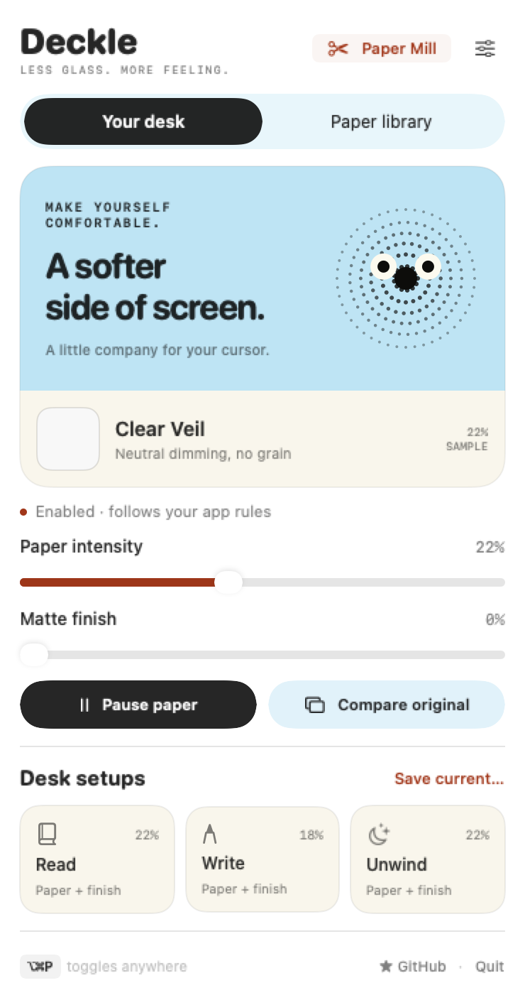
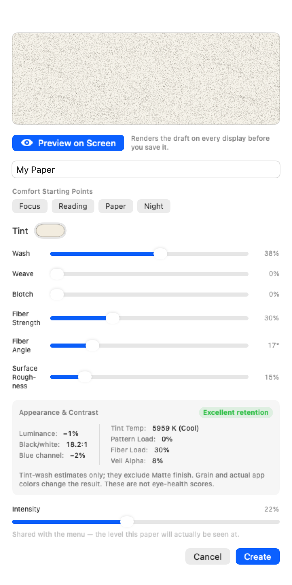
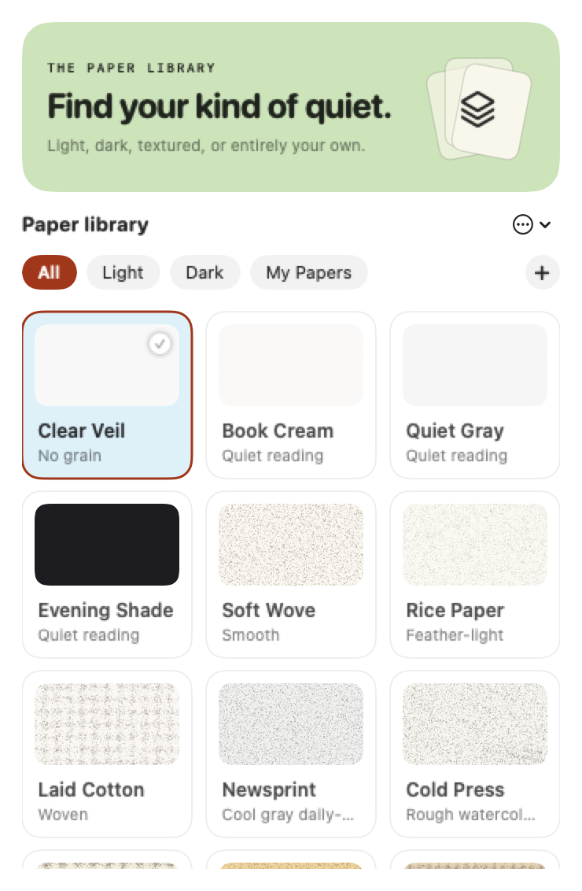
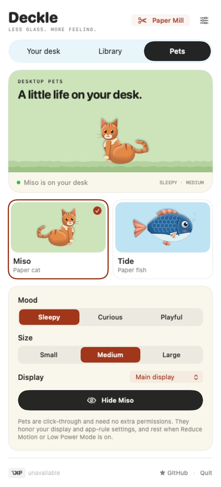
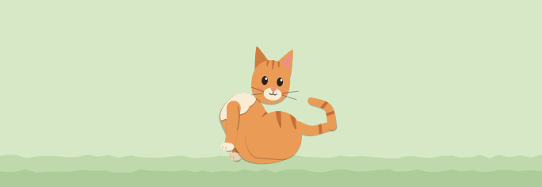
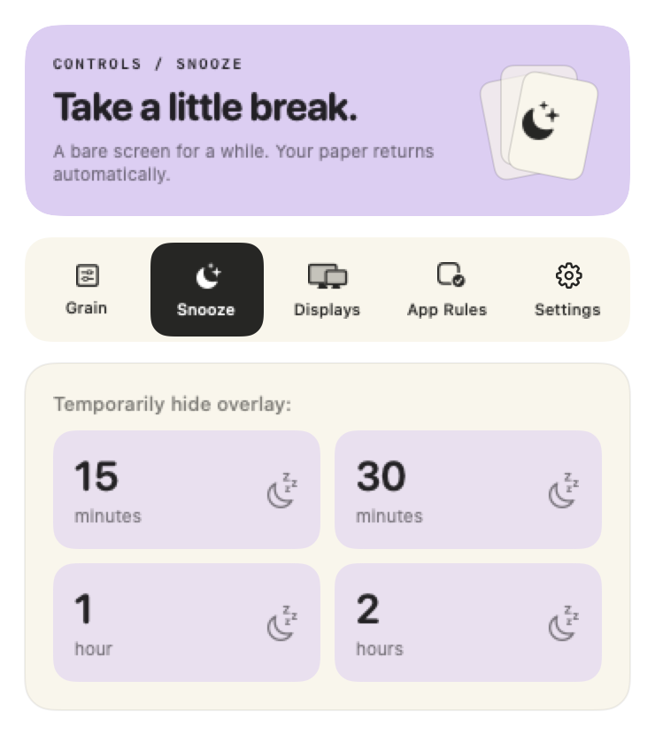
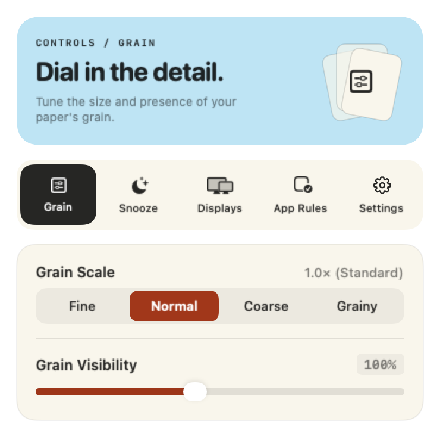
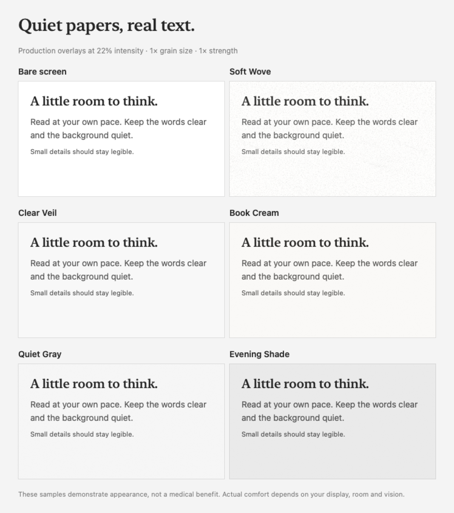

# Deckle

[](https://github.com/Kelvanic/deckle/releases/latest)
[](https://github.com/Kelvanic/deckle/releases)
[](LICENSE)


**[kelvanic.com/products/deckle](https://kelvanic.com/products/deckle/)**

A free, open-source macOS menu bar app that lays a subtle **paper-grain texture over your entire screen**, making long reading and writing sessions feel more like paper than glass. Choose a paper, tune your desk, and save the whole setup for your next reading or writing session.


> If Deckle makes your screen nicer, [a star](https://github.com/Kelvanic/deckle) helps other people find it ⭐

*A deckle is the wooden frame used in hand papermaking — it leaves behind the soft, feathered "deckle edge" that marks real handmade paper.*

Not a calibrated blue-light filter — a *matte texture* overlay. Choose a smooth dimming veil or a textured finish; every pixel of your work stays interactive because the overlay is fully click-through. A software overlay does not change the glass’s physical reflectivity. Paper Mill reports estimated blue-channel reduction and contrast retention as design guidance, not a medical claim.

## At a glance

<table>
  <tr>
    <td width="46%" align="center"></td>
    <td width="54%" align="center"></td>
  </tr>
  <tr>
    <td align="center"><strong>Your paper, your desk.</strong><br><sub>A labelled paper sample, temporary comparison, and one-click saved setups.</sub></td>
    <td align="center"><strong>Preview before you commit.</strong><br><sub>Blend a paper on the real display, inspect its contrast, then create it.</sub></td>
  </tr>
</table>

## Features

- **Desk setups** — start with Read, Write, or Unwind, or save up to eight named combinations (names up to 32 characters) of paper, intensity, grain size, grain strength, and matte finish. Applying a setup enables the paper and ends a snooze; display exclusions and app rules still apply. Right-click a setup to remove it. Setups reference your saved papers, so a deleted paper must be restored before its setup can be used. Saving and applying setups is unavailable while a Paper Mill draft is being previewed.
- **Compare original** — temporarily see your bare screen without changing saved settings or a snooze. It ends when you choose Back to paper, pick another paper, switch tabs, or close the menu.
- **A living dotted companion** — Echo's six counter-rotating rings breathe around a pulsing core, with blinking eyes that follow the cursor and a spring squash on click. The native animation uses the geometry and motion parameters from the [Cloudstudio reference](https://cloudstudio.es/). It pauses when the menu is hidden or Reduce Motion is enabled; the desktop overlay stays static.
- **A complete paper studio** — the library has a swatch-gallery layout; all five controls tabs fit at once; Paper Mill groups draft controls with a pinned Save/Cancel bar. Illustrated headers fan gently on hover and respect Reduce Motion.
- **Paper-cut desktop pets** — an opt-in companion layer with its own menu tab. Pets never follow a fixed loop: each draws a fresh seeded plan about once a minute.
  - *Miso* is a jointed ginger tabby that wanders the bottom of the screen. It sits up to watch your cursor, looks back over its shoulder, grooms a raised paw, stretches with a yawn, and kneads before napping in a loaf with drifting z's. When playful it also pounces, chases its tail, and gets the zoomies.
  - *Tide* is a blue paper fish with pleated fins that drifts through the screen in slow loops. It darts and glides, loops the loop, stops to nibble, dozes as it sinks, barrel-rolls, and turns edge-on like a folded card.

  Choose a Sleepy, Curious, or Playful mood (which shifts how often each behavior appears), a size, and a display. Pets are always click-through, need no permissions, honor your display exclusions and app rules, settle into a calm still pose under Reduce Motion or Low Power Mode, and hide while the display sleeps. The paper texture stays fully static — pets animate in their own small window, so enabling a companion never turns the overlay into a per-frame renderer.
- **A paper-first workspace** — *Your desk* shows the Echo companion, a labelled paper sample, intensity and matte controls, and your setups; *Paper library* provides browsing and search; *Pets* manages the companions; *Controls and settings* replaces the menu content with grain, snooze, display, app-rule, and app settings.
- **26 built-in papers**, grouped in the source as:
  - *Quiet reading* — Clear Veil (no grain), Book Cream, Quiet Gray, Evening Shade
  - *Papers* — Soft Wove, Rice Paper, Laid Cotton, Newsprint, Cold Press, Artist Canvas
  - *Warm* — Foxed Amber, Bookcloth, Recycled Kraft
  - *Tinted* — Plum Kozo, Rose Quartz, Sage Press, Nordic Sky, Frost Glassine, Felt Side
  - *Dark* — Ink Stone, Midnight Slate, Espresso
  - *Fiber-forward* — Gesso Ground, Linen Veil, Parchment Grain, Slate Veil — the strongest fiber strands and surface roughness, with deeper tints

  Every built-in renders with the same fiber engine and has its own grain seed. In the library they are filtered as Light or Dark.
- **Searchable paper library** — search names, descriptions, IDs, and material terms such as `woven`, `dark`, `custom`, or `quiet reading`. Search ignores case, accents, and repeated whitespace, and matches terms in any order. Filter by All, Light, Dark, or My Papers. Switching views resizes the menu to fit its content.
- **Paper Mill with live screen preview** — tune tint, wash (10–60%), weave (0–35%), blotch (0–40%), fiber strength, fiber angle (0–90°), and surface roughness against your actual desktop before creating or saving the paper. The shared intensity slider sets the level the paper is judged at.
- **Appearance guidance** — Paper Mill estimates luminance change, black/white contrast and its retention grade, blue-channel reduction, tint temperature, pattern load, fiber load, and veil alpha, and offers four starting recipes: Focus, Reading, Paper, and Night. Estimates model the tint wash only: they exclude grain and the Matte finish control.
- **Paper portability** — export a custom paper as `<name>.decklepaper.json` and import one or more files later. Imports get a fresh ID, so they never overwrite a local paper; files that can't be read are reported. **Duplicate in Paper Mill…** on a built-in copies its full recipe, so the copy looks identical until you edit it.
- **Intensity and grain controls** — intensity from 5–45% (default 22%), grain size Fine, Normal, Coarse, or Grainy (0.5×, 1×, 2×, 4×), grain visibility from 25–200%, and a matte finish from 0–100%.
- **Global hotkey** — ⌥⌘P toggles the paper from any app. If macOS refuses the registration, the menu footer says the shortcut is unavailable.
- **In-app updates** — Deckle checks GitHub Releases about 5 seconds after launch and then roughly daily. When a newer version exists, the menu offers **Update**; with **Install updates automatically** turned on (off by default) it installs without asking. In-place installation requires Deckle to run from a writable folder such as `/Applications` or `~/Applications`, and the download must carry Deckle's Developer ID signature. Otherwise Deckle explains the blocker and offers the release page.
- **Per-app rules** — show the paper everywhere, hide it while chosen apps are frontmost ("Except…"), or show it only while they are frontmost ("Only…"). Deckle's own windows always count as allowed.
- **Automation** — `deckle://` URL commands work from Shortcuts, Raycast, Alfred, cron, or Terminal
- **Capture privacy** — optionally hide the texture from macOS screenshots and recordings while it stays visible to you. macOS provides no guaranteed opt-out, so some screen-sharing and recording apps may still capture it
- **Snooze** for 15 min, 30 min, 1 hour, or 2 hours, then resume automatically. Quitting Deckle ends a snooze.
- **Multi-monitor support** — one overlay per display; include or exclude each display under Controls → Displays
- **Launch at login** — available in the bundled app
- **Click-through and lightweight** — each display tiles one small texture image, so memory does not grow with resolution, and nothing is redrawn per frame. A paused overlay does no rendering at all. A pet is one small window: a retained layer tree posed by one coalesced timer, stopped entirely while pets are off, hidden, or the display sleeps.
- **Menu-bar first** — no Dock icon or app-switcher entry; Paper Mill opens only when requested
- **Accessible** — VoiceOver labels, values, and selected states across the menu, controls, and Paper Mill, including the menu bar icon ("Deckle, paper on/off"); interface animations respect Reduce Motion
- **Settings you can't lose** — if a stored paper, setup, or app rule can't be read (for example after moving between Deckle versions), the rest still load and the original data is kept; papers are restored once a later launch can read them

<p align="center"></p>

<table>
  <tr>
    <td width="46%" align="center"></td>
    <td width="54%" align="center"><br></td>
  </tr>
  <tr>
    <td align="center"><strong>A little life on your desk.</strong><br><sub>Opt-in paper companions with a mood, a size, and a display.</sub></td>
    <td align="center"><strong>Paper puppets, not sprites.</strong><br><sub>Jointed cut-paper layers with seeded, never-repeating habits.</sub></td>
  </tr>
</table>
<p align="center"><sub>The desk, library, Paper Mill, and Pets images are native renders of the current views with isolated sample settings, not screenshots of a running menu.</sub></p>

<table>
  <tr>
    <td width="46%"></td>
    <td width="54%"></td>
  </tr>
</table>

## Quiet reading collection

Start with **Clear Veil** for neutral dimming without grain, **Book Cream** for a faint warm finish, **Quiet Gray** for fine texture, or **Evening Shade** for deeper dimming. They appear first in Paper library, and new installations start on Clear Veil at 22% intensity; search `quiet reading` to show all four. Try 18–22% intensity and adjust to your display and room.

These presets prioritize low pattern variation and readable text. They are design choices, not clinically proven eye-strain treatments. Read the [research and rendered-tile measurements](docs/reading-presets-research.md).



## Install

Deckle requires macOS 13 or later and runs natively on Apple silicon and Intel Macs.

### Homebrew

```sh
brew tap kelvanic/tap
brew trust kelvanic/tap   # Homebrew 6+ asks once for third-party taps
brew install --cask deckle
```

The cask can lag behind the latest release; Deckle's in-app updater then offers the newest version.

### Download

Grab the DMG from the [latest release](https://github.com/Kelvanic/deckle/releases/latest), open it, and drag Deckle into Applications. Release builds are signed with a Developer ID and notarized by Apple, so they launch without a Gatekeeper warning. Each release also publishes a SHA-256 checksum file.

### Build from source

Requires a Swift 5.9 or newer toolchain (Xcode 15 or later, or its command line tools) on macOS 13+:

```sh
git clone https://github.com/Kelvanic/deckle.git
cd deckle
make install    # quits a running Deckle, builds, replaces /Applications/Deckle.app, and launches it
```

Or `make run` to build and launch it from `dist/` without installing. Local builds are ad-hoc signed. Look for the italic serif **d** in your menu bar: bold while the paper is showing, faded while it is off, snoozed, or being compared.

## How it works

- Deckle owns one borderless, transparent `NSWindow` per display at `.screenSaver` level. Each window ignores mouse events, joins every Space including full-screen ones, stays out of the window cycle, and tiles one small paper image through Core Animation, so memory does not grow with display resolution.
- Built-in and newly created papers use the deterministic **spectral fiber (v4) renderer**: a random-phase, Hermitian-symmetric frequency field is synthesized with Accelerate/vDSP and inverse-transformed into seamless grain, then layered with an optional woven crosshatch and fiber splats, sparse flecks, tapered fiber strands whose fine fibrils follow the fiber angle, and multi-octave value-noise surface roughness. Fibers and roughness only darken the field, as light-absorbing paper fibers would. Saved custom papers keep the engine they were created with (v3, v2, or the original value-noise generator), and their grain output stays byte-identical.
- One tile contains both the tint wash and the grain: 256×256 points (256 or 512 pixels, following the display's backing scale), or 128×128 points for original-engine papers. The separate Matte finish pass only adjusts the tint wash. The intensity control changes only each overlay window's `alphaValue`, and identical render inputs reuse bounded caches.
- Settings, custom papers, desk setups, and app rules persist in UserDefaults (`app.deckle.Deckle`). Bare-screen comparison and snooze are not persisted.
- Paper Mill previews an unsaved draft through the same overlay windows used by saved papers. The preview overrides pause, snooze, and app rules so the draft can be judged, still respects excluded displays, and ends when you stop the preview, save, cancel, delete, or close the editor.
- **Energy design:** after setup, the retained-mode overlay renders nothing per frame, and hidden overlays skip rendering until they are shown. State changes are coalesced to at most about 30 overlay refreshes per second, Paper Mill waits 180 ms after the last edit before updating the live preview, and the daily update check runs through `NSBackgroundActivityScheduler` so macOS can batch it.

## Automation

Anything that can open a URL can drive Deckle — Shortcuts' "Open URL" action, `open` in Terminal, Raycast, Alfred, cron:

| Command | Effect |
| --- | --- |
| `deckle://on` | Enable the paper and end any snooze |
| `deckle://off` | Pause the paper |
| `deckle://toggle` | Pause if the paper is showing; otherwise end any snooze and enable it |
| `deckle://snooze?minutes=30` | Snooze for 1–1440 minutes (default 30) |
| `deckle://resume` | End a snooze |
| `deckle://texture?id=carbon-ledger` or `?name=Ink%20Stone` | Select a built-in or custom paper. Either parameter matches IDs and names, ignoring case, spaces, and punctuation, so `Ink Stone`, `ink-stone`, and `inkstone` are equivalent; digits are kept. Unknown papers are ignored |
| `deckle://intensity?percent=25` | Set intensity; clamped to 5–45 (`value=` also works) |
| `deckle://grain?size=2&strength=1.2` | Snap grain size to the nearest of 0.5, 1, 2, or 4, and set grain visibility, clamped to 0.25–2 |

Non-finite numeric inputs such as `nan` or `inf` are ignored. Invalid numeric preferences recover to safe defaults on launch. Unknown commands do nothing.

On macOS 26 or later, a Shortcuts automation such as "Time of Day: Sunset → Open URL `deckle://on`" schedules the paper, and "When a display is connected → Open URL `deckle://texture?name=Soft%20Wove`" pairs a paper with a desk. On earlier macOS versions, use cron or `launchd` with `open "deckle://on"`.

## Development

```sh
swift run                   # run unbundled (dev)
swift test                  # full test suite
make app                    # build dist/Deckle.app (ad-hoc signed)
make build UNIVERSAL=1      # arm64 + x86_64 release compile, as the release workflow does
make clean
```

No third-party dependencies; only Apple frameworks such as SwiftUI, AppKit, Combine, Accelerate, ServiceManagement, and Carbon (for the global hotkey).

Regenerate the native review renders in `docs/` (desk, library, Paper Mill, and reading proofs) with:

```sh
DECKLE_RENDER_DIR="$PWD/docs" swift test --filter "StudioRenderTests|ReadingProofTests"
```

These renders check appearance; they do not replace testing menu-bar dismissal,
screen geometry, and live overlay behavior in the bundled app.

## Roadmap

- [Battery auto-disable & Low Power Mode awareness](https://github.com/Kelvanic/deckle/issues/17)
- [Built-in sunrise/sunset scheduling](https://github.com/Kelvanic/deckle/issues/19) (today: use a Shortcuts automation or cron with `deckle://on`)
- [Custom snooze durations](https://github.com/Kelvanic/deckle/issues/18)
- [Localization](https://github.com/Kelvanic/deckle/issues/14)

## Contributing

See [CONTRIBUTING.md](CONTRIBUTING.md) and the [good first issues](https://github.com/Kelvanic/deckle/labels/good%20first%20issue). Questions and ideas → [Discussions](https://github.com/Kelvanic/deckle/discussions).

## License

[MIT](LICENSE)
